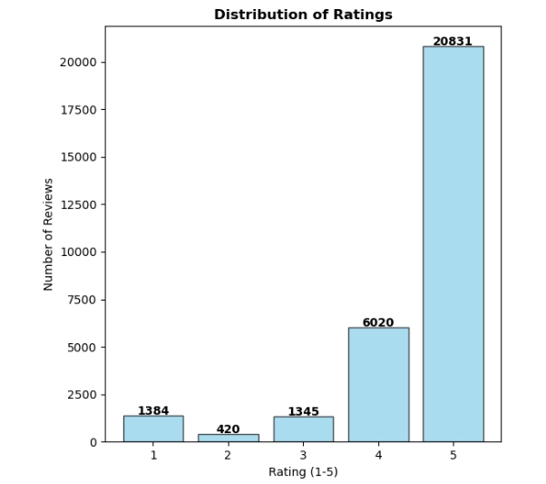
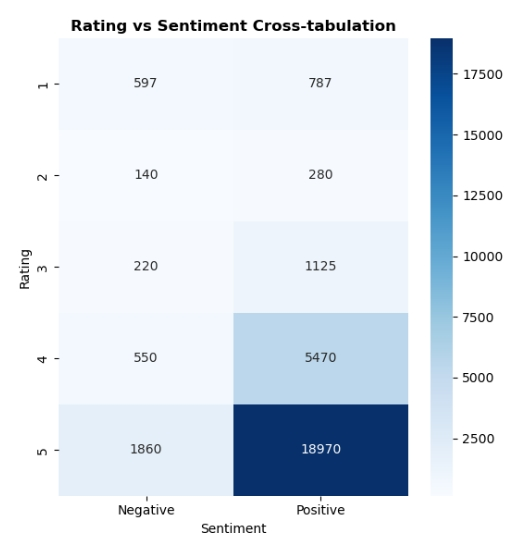
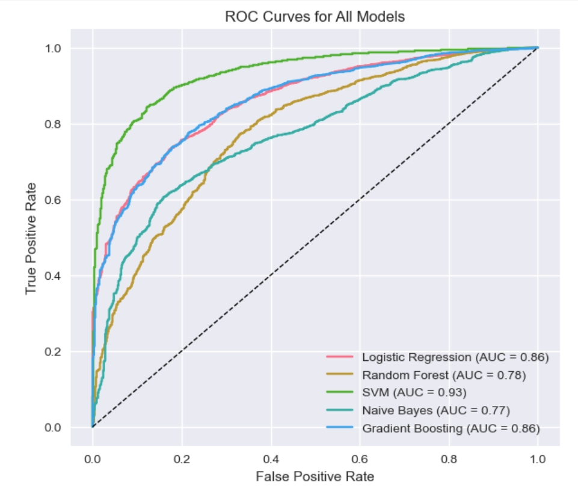
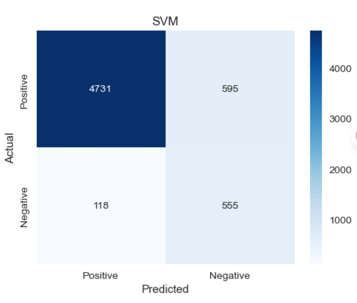

# Sentiment-Based Product Recommender

> A comprehensive machine learning solution that enhances e-commerce product recommendations through sentiment analysis of customer reviews.

[](https://www.python.org/)
[](LICENSE)
[](http://jupyter.org/)

---

## Table of Contents

- [Overview](#overview)
- [Key Features](#key-features)
- [Repository Structure](#repository-structure)
- [Data Science Workflow](#data-science-workflow)
- [Visualizations](#visualizations)
- [Installation](#installation)
- [Usage](#usage)
- [Results](#results)
- [Presentation & Resources](#presentation--resources)
- [Contributors](#contributors)

---

## Overview

This project develops a **hybrid product recommendation system** that leverages **sentiment analysis** to improve e-commerce recommendation accuracy. By integrating emotional context from customer reviews with traditional recommendation algorithms, the system delivers more personalized and emotionally-aligned product suggestions.

### Business Value

- **Improved Personalization**: Emotionally-aligned product suggestions enhance user experience
- **Increased Conversion Rates**: Better product matching leads to higher purchase likelihood
- **Reduced Returns**: Sentiment-aware filtering reduces product dissatisfaction
- **Enhanced Brand Loyalty**: Personalized experiences increase customer retention

---

## Key Features

- **Multiple ML Models**: Logistic Regression, Random Forest, SVM, Naive Bayes, and Gradient Boosting
- **Class Imbalance Handling**: SMOTE oversampling technique
- **Advanced NLP**: TF-IDF vectorization with N-gram features and lemmatization
- **Hybrid Architecture**: Integration of sentiment analysis with content-based filtering
- **Production-Ready**: Optimized model selection for real-world deployment

---

## Repository Structure

```
Capstone/
│
├── data/
│   ├── sample30.csv          # Main dataset (30,000 product reviews)
│   └── ...
│
├── models/
│   ├── logistic_regression_pipeline.pkl
│   ├── random_forest_pipeline.pkl
│   ├── svm_pipeline.pkl
│   ├── naive_bayes_pipeline.pkl
│   ├── gradient_boosting_pipeline.pkl
│   ├── hybrid_recommender.pkl
│   └── model_metadata.json
│
├── images/                    # Visualization outputs
│   └── ...
│
├── working_notebook.ipynb    # Complete analysis and modeling
├── presentation.pdf           # Project presentation
├── CapstoneProject-Idea-Rockson_et_Ralph.pdf  # Project proposal
│
└── sentiment_market_app 
│
└── README.md                  # This file
```

---

## Data Science Workflow

### 1. Business Understanding
**Problem**: Traditional recommendation systems ignore emotional context from reviews  
**Solution**: Develop a sentiment-aware recommendation system  
**Objective**: Predict sentiment polarity (Positive/Negative) from customer reviews

### 2. Data Understanding
- **Dataset**: 30,000 product reviews from e-commerce platform
- **Features**: Brand, categories, reviews text, ratings, sentiment labels
- **Key Insights**:
  - 88.8% positive vs 11.2% negative sentiment (highly imbalanced)
  - Average rating: 4.48/5.0
  - 214 unique brands, 270 categories
  - Date range: 2007-2018

### 3. Data Preparation
- **Text Cleaning**: Lowercase conversion, URL/email removal, punctuation removal
- **NLP Processing**: Lemmatization, stopword removal, tokenization
- **Feature Engineering**: Combined brand, category, title, and review text
- **Missing Values**: Handled with appropriate imputation strategies

### 4. Modeling
- **Vectorization**: TF-IDF with max_features=10,000, ngram_range=(1,2)
- **Class Balancing**: SMOTE oversampling for minority class
- **Algorithms Tested**: 5 different machine learning models
- **Hyperparameter Tuning**: Grid Search Cross-Validation with F1-score optimization

### 5. Evaluation
- **Metrics**: Accuracy, Precision, Recall, F1-Score, ROC-AUC
- **Selection Criteria**: Best F1-score for imbalanced data
- **Best Model**: SVM with 92.98% F1-score
- **Production Model**: Logistic Regression (87.51% F1-score, 59s training time)

---

## Visualizations

### Key Insights from EDA

#### 1. **Sentiment Distribution**

- **88.8% Positive** reviews vs **11.2% Negative** reviews
- Significant class imbalance requiring SMOTE technique
- Dataset strongly biased toward positive sentiment

#### 2. **Rating Distribution**
<p align="center">
  
  
</p>

- **69.4%** of reviews are 5-star ratings
- Average rating: **4.48/5.0**
- Strong correlation between high ratings and positive sentiment

#### 3. **Model Performance Comparison**

- **SVM**: Best F1-score (0.9299) but slowest training (1,226s)
- **Logistic Regression**: Optimal balance (0.8751 F1, 59s training)
- Selected for production deployment

#### 4. **Confusion Matrix - Best Model (SVM)**

- High precision for positive class (98%)
- Good recall for negative class (82%)
- Excellent overall classification performance

---

## Installation

### Prerequisites

- Python 3.8+
- Jupyter Notebook
- pip or conda

### Dependencies

```bash
# Clone the repository
git clone <repository-url>
cd dsc-phase-5-project

# Install required packages
pip install pandas numpy matplotlib seaborn scikit-learn nltk imbalanced-learn wordcloud jupyter joblib
```

### Dataset Setup

1. Download the dataset from [Kaggle](https://www.kaggle.com/datasets/venkatasubramanian/sentiment-based-product-recommendation-system/data)
2. Place `sample30.csv` in the `data/` directory

---

## Usage

### Running the Notebook

```bash
# Start Jupyter Notebook
jupyter notebook

# Open working_notebook.ipynb
# Run all cells to reproduce the analysis
```

### Using Trained Models

```python
import joblib
import pandas as pd

# Load the production model
model = joblib.load('./models/logistic_regression_pipeline.pkl')

# Predict sentiment for a new review
review = "This product is amazing! Highly recommended."
prediction = model.predict([review])
print(f"Predicted sentiment: {prediction[0]}")

# Batch prediction
reviews = [
    "Excellent quality and fast delivery",
    "Poor product, very disappointed"
]
predictions = model.predict(reviews)
print(predictions)  # ['Positive', 'Negative']
```

### Hybrid Recommendation System

```python
# Load hybrid recommender
recommender_data = joblib.load('./models/hybrid_recommender.pkl')

# Get recommendations for a product
recommended_products = recommender(
    product_id='AV14LG0R-jtxr-f38QfS',
    top_n=10,
    alpha=0.6  # Balance between similarity and sentiment
)

print(recommended_products)
```

---

## Results

### Model Performance Summary

| Model | F1-Score | Accuracy | Training Time | Status |
|-------|----------|----------|--------------|--------|
| **SVM** | **0.9299** | **0.8811** | 1,226s | Best Accuracy |
| Random Forest | 0.9052 | 0.8356 | 922s | High Performance |
| **Logistic Regression** | **0.8751** | **0.7961** | **28s** | **Production Ready** |
| Gradient Boosting | 0.8835 | 0.8081 | 387s | Strong Alternative |
| Naive Bayes | 0.8547 | 0.7608 | 3s | Fastest |

### Key Achievements

✅ **92.98% F1-Score** achieved with SVM  
✅ **Production-ready solution** with Logistic Regression (87.51% F1, 59s training)  
✅ **SMOTE technique** successfully balanced class distribution  
✅ **Comprehensive evaluation** using multiple metrics and visualizations  
✅ **Hybrid recommender** integrated for end-to-end system  

---

## Presentation & Resources

### Project Documentation
- [Project Proposal](CapstoneProject-Idea-Rockson_et_Ralph.pdf) - Initial project idea and objectives
- [Presentation](presentation.pdf) - Complete project presentation
- [Notebook](working_notebook.ipynb) - Full analysis and code

### Data Sources
- [Kaggle Dataset](https://www.kaggle.com/datasets/venkatasubramanian/sentiment-based-product-recommendation-system/data)
- **Sample30.csv**: 30,000 product reviews with sentiment labels

### Key Features Used
- `reviews_text`: Customer review text
- `user_sentiment`: Sentiment label (Positive/Negative)
- `reviews_rating`: Numerical rating (1-5)
- `brand`: Product brand
- `categories`: Product categories

---

## Contributors

- **Ralph DUMERA** - Data Scientist
- **Rockson** - Data Scientist

---

## Contact

For questions or collaboration opportunities, please reach out through the repository issues.


