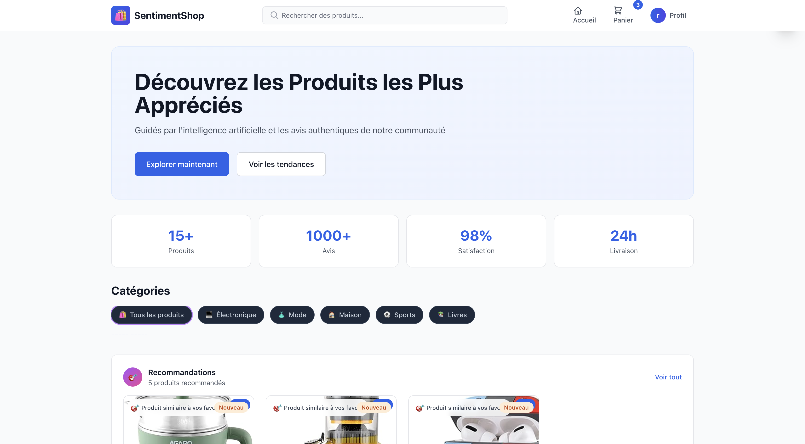
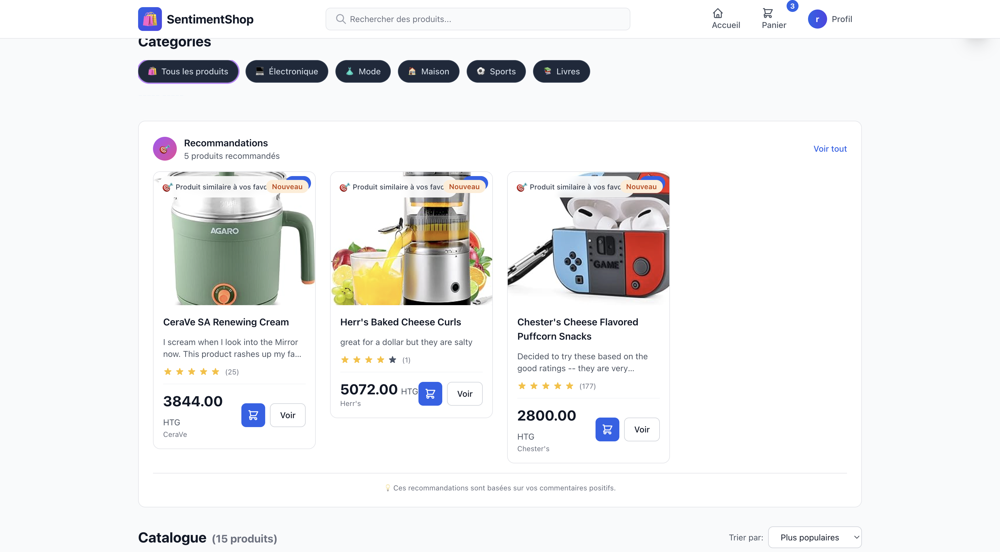

# Sentiment Market - AI-Powered E-Commerce Platform
[](https://github.com/noelRockson/sentiment_market/blob/main/images/sentiment_market.png)

[](https://github.com/noelRockson/sentiment_market/blob/main/images/recom.png)

A full-stack e-commerce application with intelligent sentiment analysis and personalized product recommendations powered by Machine Learning.

## Table of Contents

- [Overview](#overview)
- [Features](#features)
- [Technology Stack](#technology-stack)
- [System Architecture](#system-architecture)
- [Installation](#installation)
- [Configuration](#configuration)
- [Running the Application](#running-the-application)
- [API Documentation](#api-documentation)
- [Machine Learning Models](#machine-learning-models)
- [Network Configuration](#network-configuration)
- [Project Structure](#project-structure)
- [Contributing](#contributing)
- [License](#license)

## Overview

Sentiment Market is an advanced e-commerce platform that combines traditional online shopping with cutting-edge AI capabilities. The system analyzes customer reviews in real-time using Natural Language Processing (NLP) to determine sentiment, and provides personalized product recommendations based on user preferences and behavior.

### Key Highlights

- **Real-time Sentiment Analysis**: Automatically analyzes customer reviews to extract sentiment (Positive/Negative) with confidence scores
- **Hybrid Recommendation System**: Combines content-based filtering with sentiment-aware recommendations
- **Personalized Experience**: Dynamically generates product recommendations based on user's liked products
- **Responsive Design**: Modern, mobile-first UI built with React and TailwindCSS
- **Multi-Network Support**: Automatically adapts to different network configurations (localhost/LAN)

## Features

### For Customers
- Browse and search products with advanced filtering
- Leave reviews and ratings on products
- Get personalized product recommendations based on your preferences
- View detailed product information with ratings and reviews
- Secure user authentication with Firebase
- Fully responsive design for all devices

### For Business
- Real-time sentiment analysis of customer feedback
- AI-powered recommendation engine to boost sales
- User preference tracking and analytics
- Automatic sentiment classification of reviews
- Content-based product similarity matching

## Technology Stack

### Frontend
- **React 18** - Modern UI library
- **TailwindCSS** - Utility-first CSS framework
- **Axios** - HTTP client for API requests
- **React Router** - Client-side routing
- **Firebase Auth** - User authentication

### Backend
- **Node.js & Express** - RESTful API server
- **MongoDB & Mongoose** - NoSQL database
- **Nodemon** - Development auto-reload

### Machine Learning Service
- **Python 3.x** - Programming language
- **FastAPI** - High-performance ML API framework
- **scikit-learn** - Machine learning algorithms
- **NLTK** - Natural language processing
- **imbalanced-learn (SMOTE)** - Handling imbalanced datasets
- **pandas & numpy** - Data manipulation
- **joblib** - Model serialization

### Machine Learning Models
- **Random Forest Classifier** - Primary sentiment classification model
- **hybrid_recommender** - Content-based on hybrid recommendation


## System Architecture

```
┌─────────────────┐         ┌─────────────────┐         ┌─────────────────┐
│                 │         │                 │         │                 │
│  React Frontend │────────▶│  Express API    │────────▶│    MongoDB      │
│  (Port 3000)    │         │  (Port 5050)    │         │  (Port 27017)   │
│                 │         │                 │         │                 │
└─────────────────┘         └────────┬────────┘         └─────────────────┘
                                     │
                                     │
                                     ▼
                            ┌─────────────────┐
                            │   ML Service    │
                            │  FastAPI/Uvicorn│
                            │   (Port 8001)   │
                            └─────────────────┘
```

### Data Flow

1. **User Review Submission**:
   - User submits review → Frontend → Backend API
   - Backend sends review + product metadata → ML Service
   - ML Service analyzes sentiment → Returns prediction
   - Backend stores review with sentiment → Updates user preferences
   - System generates new recommendations

2. **Personalized Recommendations**:
   - User logs in → Frontend requests recommendations
   - Backend retrieves user's liked products
   - For each liked product → ML Service finds similar products
   - Backend aggregates, deduplicates, and ranks recommendations
   - Frontend displays top recommendations with product details

## Installation

### Prerequisites

- **Node.js** (v14 or higher) - [Download](https://nodejs.org/)
- **Python** (v3.8 or higher) - [Download](https://www.python.org/)
- **MongoDB** (v4.4 or higher) - [Download](https://www.mongodb.com/try/download/community)
- **Git** - [Download](https://git-scm.com/)

### Step 1: Clone the Repository

```bash
git clone https://github.com/yourusername/sentiment_market_app.git
cd sentiment_market_app
```

### Step 2: Install Backend Dependencies

```bash
cd backend
npm install
```

### Step 3: Install Frontend Dependencies

```bash
cd ../frontend
npm install
```

### Step 4: Install ML Service Dependencies

```bash
cd ../ml_service
pip install -r requirements.txt
```

### Step 5: Download NLTK Data

```bash
python -c "import nltk; nltk.download('punkt'); nltk.download('stopwords'); nltk.download('wordnet')"
```

## ⚙️ Configuration

### Backend Configuration

Create a `.env` file in the `backend` directory (or update `config/db.js`):

```env
MONGODB_URI=mongodb://localhost:27017/sentiment_market
PORT=5050
```

### Frontend Configuration

The frontend automatically detects the API URL based on the hostname:
- **Localhost**: `http://localhost:5050`
- **Network**: `http://<your-ip>:5050`

Configuration is handled in `frontend/src/config/api.js`.

### Firebase Configuration

Update `frontend/src/firebaseConfig.js` with your Firebase credentials:

```javascript
const firebaseConfig = {
  apiKey: "YOUR_API_KEY",
  authDomain: "YOUR_AUTH_DOMAIN",
  projectId: "YOUR_PROJECT_ID",
  storageBucket: "YOUR_STORAGE_BUCKET",
  messagingSenderId: "YOUR_MESSAGING_SENDER_ID",
  appId: "YOUR_APP_ID"
};
```

### ML Service Configuration

The ML service uses pre-trained models located in `ml_service/model/`:
- `random_forest_pipeline.pkl` - Sentiment classification model
- `hybrid_recommender.pkl` - Product recommendation data

## Running the Application

### Option 1: Manual Start (Recommended for Development)

**Terminal 1 - MongoDB**:
```bash
mongod
```

**Terminal 2 - Backend API**:
```bash
cd backend
npm start
```

**Terminal 3 - ML Service**:
```bash
cd ml_service
python -m uvicorn app:app --host 0.0.0.0 --port 8001
```

**Terminal 4 - Frontend**:
```bash
cd frontend
npm start
```

### Option 2: Using Process Managers

**Using PM2 (Backend)**:
```bash
cd backend
npm install -g pm2
pm2 start server.js --name sentiment-market-backend
```

**Using Uvicorn (ML Service)**:
```bash
cd ml_service
uvicorn app:app --host 0.0.0.0 --port 8001 --reload
```

### Access the Application

- **Frontend**: http://localhost:3000
- **Backend API**: http://localhost:5050
- **ML Service**: http://localhost:8001
- **MongoDB**: mongodb://localhost:27017

## API Documentation

### Backend API Endpoints

#### Products
- `GET /api/products` - Get all products (with pagination)
- `GET /api/products/:id` - Get product by ID
- `GET /api/products/search?q=query` - Search products

#### Reviews
- `POST /api/reviews` - Add a new review
- `GET /api/reviews/product/:productId` - Get reviews for a product
- `GET /api/reviews/user/:userEmail` - Get reviews by user email

#### Recommendations
- `GET /api/recommendations/user/:userId` - Get personalized recommendations
- `GET /api/recommendations/preferences/:userId` - Get user preferences
- `POST /api/recommendations/refresh/:userId` - Refresh recommendations
- `GET /api/recommendations/stats` - Get recommendation statistics

### ML Service Endpoints

#### Sentiment Analysis
```bash
POST /predict
Content-Type: application/json

{
  "text": "I love this product!",
  "brand": "BrandName",
  "categories": "Category1, Category2",
  "title": "Product Name"
}

Response:
{
  "sentiment": "positive",
  "confidence": 0.85
}
```

#### Product Recommendations
```bash
GET /recommend/{product_id}?top_n=10&alpha=0.7

Response:
{
  "product_id": "AVpf7HOwilAPnD_xkl3L",
  "recommendations": [
    {
      "id": "AVpfEqFbilAPnD_xUV28",
      "similarity": 0.566,
      "avg_sentiment": 0.8,
      "review_count": 25,
      "hybrid_score": 0.636
    }
  ]
}
```

## Machine Learning Models

### Sentiment Analysis Model

**Algorithm**: Random Forest Classifier with TF-IDF vectorization

**Features**:
- Combined text features (brand + categories + title + review text)
- Advanced preprocessing (tokenization, lemmatization, stopword removal)
- Negation handling for improved accuracy
- SMOTE for handling class imbalance

**Performance**:
- Confidence threshold: 0.5 for user preference updates
- Fallback keyword-based analysis for edge cases
- Real-time prediction with < 100ms latency

### Recommendation System

**Type**: Hybrid Content-Based Filtering

**Components**:
1. **Content Similarity**:
   - TF-IDF vectorization of product features
   - Cosine similarity between products
   
2. **Sentiment Weighting**:
   - Average sentiment scores from reviews
   - Hybrid scoring: `alpha * similarity + (1-alpha) * sentiment`
   
3. **Personalization**:
   - Tracks user's liked products (positive reviews)
   - Generates recommendations for each liked product
   - Deduplicates and ranks by hybrid score

**Algorithm**:
```
For each product P in user's liked products:
  1. Find top N similar products using cosine similarity
  2. Calculate hybrid score = 0.7 * similarity + 0.3 * avg_sentiment
  3. Add to recommendation pool

Remove duplicates and products user already liked
Sort by hybrid score and return top 10
```

## Network Configuration

The application supports both local and network access with automatic configuration.

### Local Access (Single Machine)

```
Frontend:  http://localhost:3000
Backend:   http://localhost:5050
ML Service: http://localhost:8001
```

### Network Access (Multiple Machines)

**Server Machine**:
1. Find your local IP: `ipconfig` (Windows) or `ifconfig` (Mac/Linux)
2. Services automatically bind to `0.0.0.0` to accept network connections

**Client Machine**:
1. Access frontend: `http://<server-ip>:3000`
2. API calls automatically use: `http://<server-ip>:5050`

### How It Works

The frontend automatically detects the hostname and adjusts API URLs:

```javascript
// frontend/src/config/api.js
const hostname = window.location.hostname;
const apiUrl = hostname === 'localhost' 
  ? 'http://localhost:5050' 
  : `http://${hostname}:5050`;
```

The backend services (`recommendationService.js`) also detect the hostname for ML service calls.

### Troubleshooting Network Issues

**Issue**: ERR_CONNECTION_REFUSED on network
- **Solution**: Ensure firewall allows connections on ports 3000, 5050, 8001
- **Windows**: `netsh advfirewall firewall add rule name="Allow Port" dir=in action=allow protocol=TCP localport=5050`
- **Mac**: System Preferences → Security & Privacy → Firewall → Firewall Options

**Issue**: Services not accessible from other machines
- **Solution**: Verify services are binding to `0.0.0.0` instead of `127.0.0.1`
- Check `backend/server.js`: `app.listen(PORT, '0.0.0.0', ...)`
- Check ML service: `uvicorn app:app --host 0.0.0.0 --port 8001`

## 📁 Project Structure

```
sentiment_market_app/
├── backend/                    # Express.js backend
│   ├── config/                 # Configuration files
│   │   └── db.js              # MongoDB connection
│   ├── controllers/           # Request handlers
│   │   ├── productController.js
│   │   ├── reviewController.js
│   │   └── recommendationController.js
│   ├── models/                # Mongoose schemas
│   │   ├── productModel.js
│   │   ├── reviewModel.js
│   │   └── userPreferenceModel.js
│   ├── routes/                # API routes
│   │   ├── productRoutes.js
│   │   ├── reviewRoutes.js
│   │   └── recommendationRoutes.js
│   ├── services/              # Business logic
│   │   └── recommendationService.js
│   ├── utils/                 # Utility functions
│   │   └── sentimentService.js
│   ├── server.js              # Entry point
│   └── package.json
│
├── frontend/                  # React frontend
│   ├── public/
│   │   └── index.html
│   ├── src/
│   │   ├── components/        # React components
│   │   │   ├── ProductCard.jsx
│   │   │   ├── ReviewForm.jsx
│   │   │   ├── PersonalizedRecommendations.jsx
│   │   │   ├── UserProfile.jsx
│   │   │   ├── LoginForm.jsx
│   │   │   └── SignupForm.jsx
│   │   ├── pages/            # Page components
│   │   │   ├── Home.jsx
│   │   │   ├── ProductDetail.jsx
│   │   │   └── Products.jsx
│   │   ├── context/          # React context
│   │   │   └── AuthContext.jsx
│   │   ├── config/           # Configuration
│   │   │   └── api.js        # Dynamic API URL
│   │   ├── hooks/            # Custom hooks
│   │   │   └── useAPI.js
│   │   ├── firebaseConfig.js # Firebase setup
│   │   ├── App.js            # Main app component
│   │   └── index.js          # Entry point
│   └── package.json
│
├── ml_service/               # Machine Learning service
│   ├── model/               # Trained models
│   │   ├── random_forest_pipeline.pkl
│   │   └── hybrid_recommender.pkl
│   ├── utils/               # Utility functions
│   │   └── preprocess.py   # Text preprocessing
│   ├── app.py              # FastAPI application
│   └── requirements.txt    # Python dependencies
│
└── README.md               # This file
```

## 🔑 Key Features Explanation

### 1. Sentiment Analysis

The sentiment analysis system processes review text through multiple stages:

**Text Preprocessing**:
```python
1. Clean text (remove special characters, lowercase)
2. Tokenize into words
3. Remove stopwords
4. Lemmatization (convert to base form)
```

**Feature Engineering**:
- Combines product metadata (brand, categories, title) with review text
- TF-IDF vectorization creates numerical representations
- Features are normalized for consistent scaling

**Prediction**:
- Random Forest classifier with 100 estimators
- Outputs: sentiment (positive/negative/neutral) and confidence score
- Negation detection for phrases like "don't like", "not good"

### 2. Personalized Recommendations

The recommendation engine works in these steps:

**User Profile Building**:
- Tracks products with positive reviews (confidence ≥ 0.5)
- Stores product metadata (brand, categories)
- Maintains list of liked products per user

**Recommendation Generation**:
```
For each liked product:
  1. Query ML service for 10 similar products
  2. ML service calculates content similarity (TF-IDF + cosine)
  3. ML service computes hybrid score with sentiment
  4. Backend enriches with full product details

Aggregate all recommendations:
  5. Remove duplicates
  6. Exclude already liked products
  7. Sort by hybrid score
  8. Return top 10
```

**Fallback for New Users**:
- Users without reviews get top-rated products
- Criteria: rating ≥ 4.0, minimum 5 reviews
- Sorted by rating and review count

### 3. Dynamic Network Configuration

The system automatically adapts to network changes:

**Frontend Detection**:
```javascript
const hostname = window.location.hostname;
// If localhost: use localhost URLs
// If IP address: use IP-based URLs
```

**Backend Detection**:
```javascript
const hostname = os.hostname();
const mlServiceUrl = hostname === 'localhost'
  ? 'http://localhost:8001'
  : `http://${hostname}:8001`;
```

**Benefits**:
- No manual configuration needed
- Works seamlessly on different networks
- Supports both development and production

## Testing

### Testing Sentiment Analysis

```bash
curl -X POST http://localhost:8001/predict \
  -H "Content-Type: application/json" \
  -d '{
    "text": "This product is amazing!",
    "brand": "BrandName",
    "categories": "Electronics",
    "title": "Product Title"
  }'
```

### Testing Recommendations

```bash
curl http://localhost:8001/recommend/AVpf7HOwilAPnD_xkl3L?top_n=5&alpha=0.7
```

### Testing Backend API

```bash
# Get products
curl http://localhost:5050/api/products

# Get recommendations
curl http://localhost:5050/api/recommendations/user/USER_ID
```

## Common Issues & Solutions

### Issue: MongoDB Connection Failed
**Solution**: 
- Ensure MongoDB is running: `mongod`
- Check connection string in `backend/config/db.js`
- Verify port 27017 is not in use

### Issue: ML Service Model Not Found
**Solution**:
- Verify model files exist in `ml_service/model/`
- Check file paths in `ml_service/app.py`
- Ensure models were trained and saved properly

### Issue: CORS Errors
**Solution**:
- Backend already configured with CORS middleware
- If issues persist, check `backend/server.js` CORS settings
- Ensure frontend URL is allowed in CORS origin

### Issue: Recommendations Not Updating
**Solution**:
- Make positive reviews (not neutral/negative)
- Ensure confidence score ≥ 0.5
- Comment on different products (not the same one)
- Check backend logs for errors

### Issue: Images Not Displaying
**Solution**:
- Verify product data includes `imageUrl` field
- Check network connectivity for external images
- Inspect browser console for 404 errors

## Performance Optimization

### Backend
- MongoDB indexing on frequently queried fields
- Caching user preferences in memory (future enhancement)
- Pagination for product lists

### Frontend
- React lazy loading for routes
- Image optimization with lazy loading
- Debouncing search inputs

### ML Service
- Model loaded once at startup
- Pre-computed similarity matrices
- Fast TF-IDF transformations with sparse matrices

## 🔐 Security Considerations

- Firebase Authentication for user management
- Input validation on all API endpoints
- MongoDB injection prevention with Mongoose
- CORS configured to allow specific origins
- Environment variables for sensitive data

## Future Enhancements

- [ ] Add user wishlist functionality
- [ ] Implement product comparison feature
- [ ] Add admin dashboard for analytics
- [ ] Integrate payment gateway
- [ ] Add product image upload
- [ ] Implement real-time notifications
- [ ] Add multi-language support
- [ ] Implement A/B testing for recommendations
- [ ] Add collaborative filtering to recommendations
- [ ] Implement caching layer (Redis)

## 🤝 Contributing

Contributions are welcome! Please follow these steps:

1. Fork the repository
2. Create a feature branch (`git checkout -b feature/AmazingFeature`)
3. Commit your changes (`git commit -m 'Add some AmazingFeature'`)
4. Push to the branch (`git push origin feature/AmazingFeature`)
5. Open a Pull Request

### Coding Standards

- **JavaScript**: Use ES6+ syntax, follow Airbnb style guide
- **Python**: Follow PEP 8 style guide
- **React**: Use functional components and hooks
- **Commit messages**: Follow conventional commits format

## Authors and Contributions

This project was developed by **Rockson NOEL** and **Ralph Djino DUMERA**, with the following division of roles:

- **Ralph Djino DUMERA**
  - **Primary Role:** Data Scientist / Full Stack Developer
  - **Contributions:**
    - Full development of the sentiment analysis pipeline in the **Jupyter Notebook** (preprocessing, vectorization).
    - Training of the sentiment model (Logistic Regression).
    - Implementation of **Metadata Vectorization** (Brands, Categories).
    - Design and implementation of the **Frontend Application** user interface (UI).
  - **GitHub:** [ralphy89](https://github.com/ralphy89)

- **Rockson NOEL**
  - **Primary Role:** Backend Engineer / Integration
  - **Contributions:**
    - Design and development of the **FastAPI API** for prediction and recommendation services.
    - Management of backend infrastructure and dependencies.
    - Integration of data reading logic from **MongoDB Atlas**.
  - **GitHub:** [noelRockson](https://github.com/noelRockson)

## Acknowledgments

- scikit-learn for machine learning algorithms
- NLTK for natural language processing tools
- MongoDB for flexible data storage
- Firebase for authentication services
- React community for excellent documentation
- FastAPI for high-performance ML API framework

---

**Built using React, Node.js, Python, and Machine Learning**
